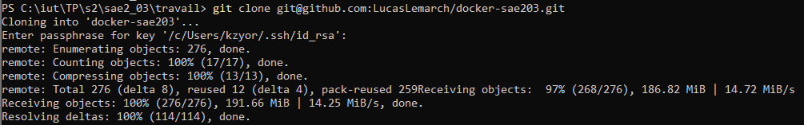
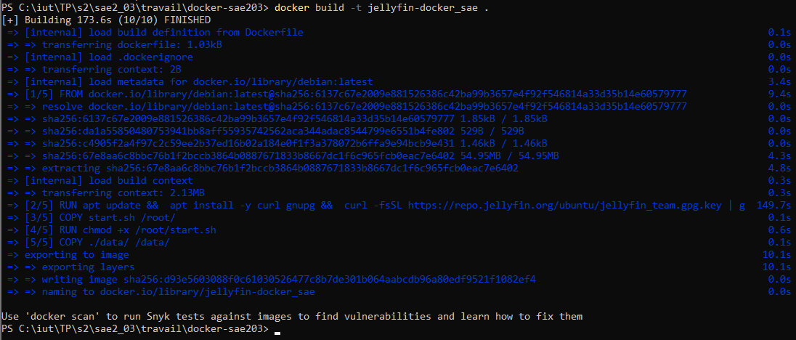
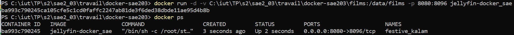
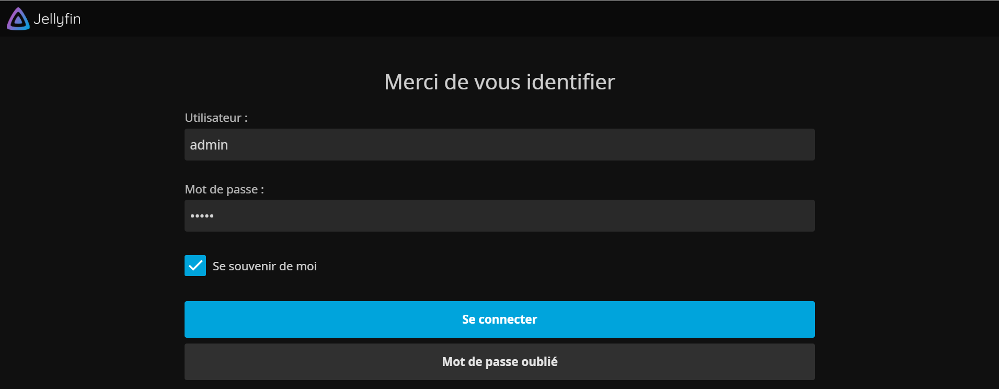

# Tutoriel : Comment lancer JellyFin ?

## Pré-requis

    Pour ce tutoriel, nous partirons du principe que vous possédez un GitHub fonctionnel ainsi que le logiciel Docker Deskop sur votre ordinateur.

## Etape 1 - Ouverture de Docker Desktop

    Pour commencer, ouvrir le logiciel _Docker Desktop_ et le laisser en fond.
    Nous n'en aurons pas directement besoin mais il sera utile pour la réalisation de certaines commandes docker...

## Etape 2 - Récupération des fichiers sur GitHub

    Pour récupérer les fichiers sur GitHub, il faudra dans un premier temps ouvrir le cmd dans lequel vous pouvez utiliser les commandes git, et placer vous dans le fichier où vous souhaitez cloner le GitHub.   
    Tapez ensuite la commandes suivantes : 
    _git clone git@github.com:LucasLemarch/docker-sae203.git_ 
    Utiliser ensuite la commande _cd docker-sae203_ pour rentrer dans le fichier venant d'être créer.

## Etape 3 - Création de l'image 

    Pour créer l'image, toujours en étant de le dossier créer précedement (docker-sae203) tapez la commande : 
    _docker build --no-cache -t [color=#FF0000]jellyfin-docker_sae .[/color]_ 
    Où _[color=#FF0000]jellefin-docker_sae[/color]_ est le nom de l'image. 
    Ne pas oublier le "." à la fin de la commande. 
    La création de l'image peut durer plusieurs minutes.

## Etape 4 - Lancement de l'image

    Une fois la création terminer, il faut maintenant lancer l'image, pour se faire, utiliser la commande : 
    _docker run -d -v [color=#207125]C:\iut\TP...[/color]:/data/films -p 8080:8096 [color=#FF0000]jellyfin-docker_sae[/color]_ 
    Après cela, pour vérifier que l'image est correctement lancé, utiliser la commande : 
    _docker ps_

    Vous devriez normalement voir le nom de l'image ainsi que son statut etc...

## Etape 5 - Le site

    Une fois que l'image est correctement lancé, lancer un navigateur est entrez l'url : 
    _localhost:8080_ 
    Se connecter avec les identifiants _admin_;_admin_

## Etape 6 - Première connection et ajouts des films

    bla bla bla bla bla bla bla

