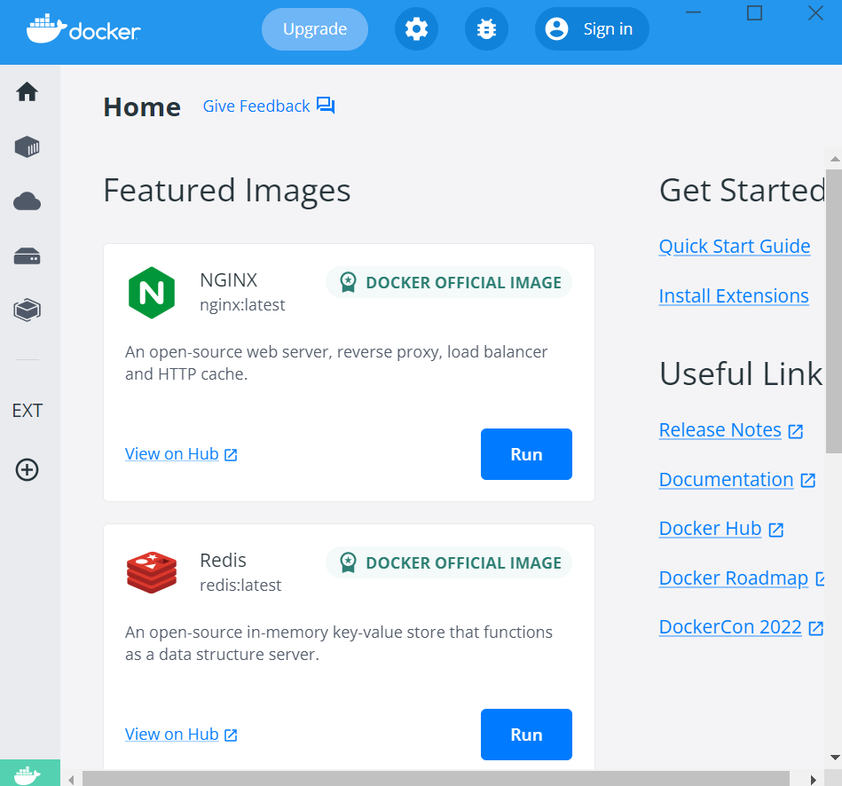
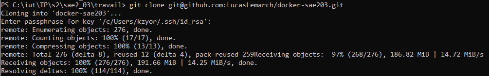
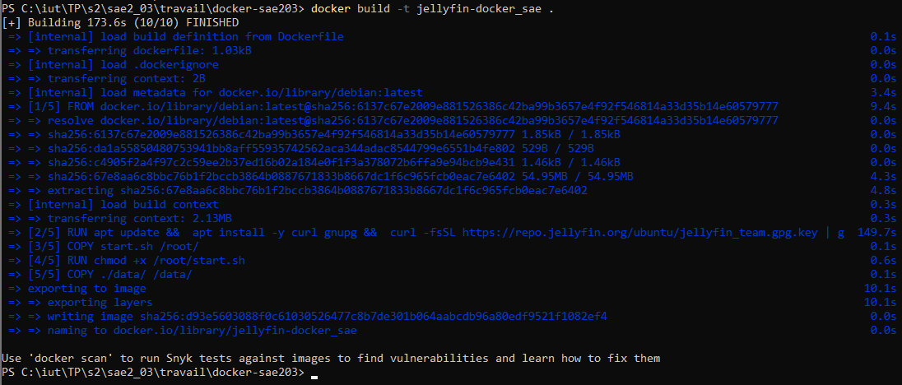
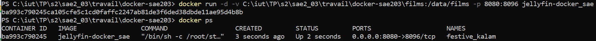
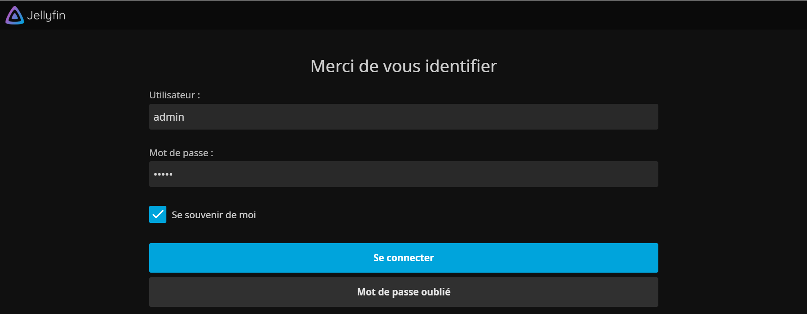
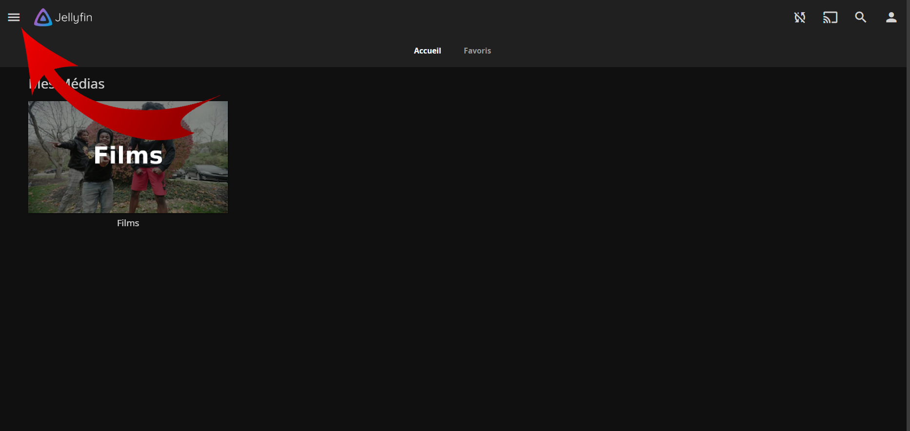
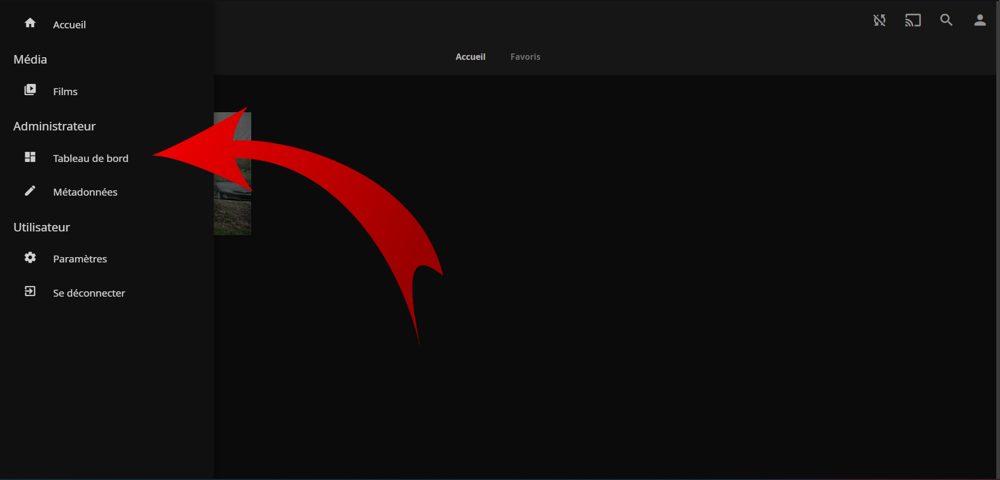
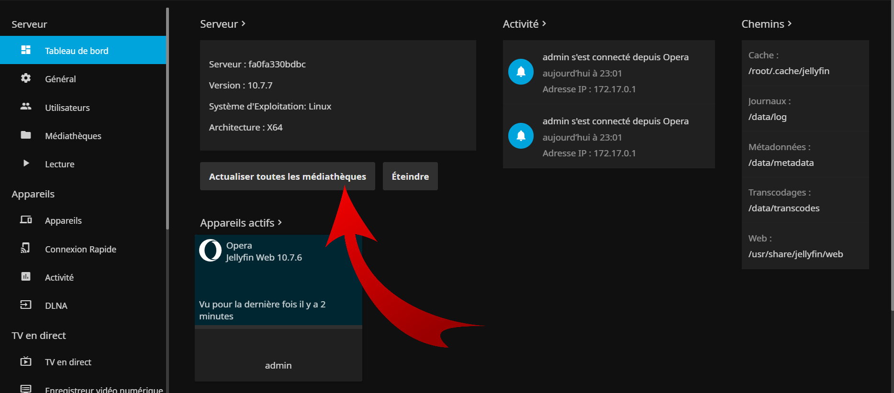
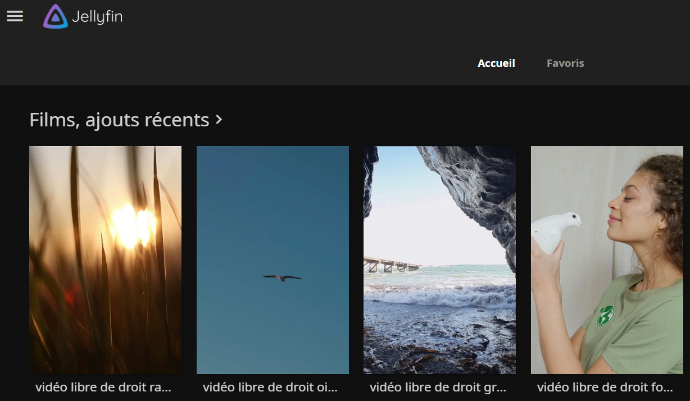

# Tutoriel : Comment lancer JellyFin ?

## Pré-requis

    Pour ce tutoriel, nous partirons du principe que vous possédez un GitHub fonctionnel ainsi que le logiciel Docker Deskop sur votre ordinateur. Si jamais ce n'etait pas le cas, nous vous conseillons les liens suivant pour les avoir : 
	<a href="https://juanluck.github.io/Introduction-GIT/">GitHub</a> / <a href="https://docs.docker.com/get-docker/">Docker</a>

## Etape 1 - Ouverture de Docker Desktop

    Ouvrez le logiciel <i>Docker Desktop</i> et réduisez-le. Il est impératif qu'il tourne en arrière plan pour le bon fonctionnement de nos manipulations.

## Etape 2 - Récupération des fichiers sur GitHub

    Ouvrez un invité de commande fonctionnant avec Github et placez-vous dans le repertoire où vous souhaitez contenir les fichiers pour faire fonctionner Jellyfin.  

    Tapez la commandes suivante : 
    <code>git clone git@github.com:LucasLemarch/docker-sae203.git</code>

	Utilisez la commande <code>cd docker-sae203</code> pour vous placer dans le dossier venant d'être récupéré.

## Etape 3 - Création de l'image 

    Créez une image docker avec la commande : 
    <code>docker build --no-cache -t [nom-image] .</code> (remplacez [nom-image] par le nom que vous voulez donner a votre image)

 /!\ Ne pas oublier le "." à la fin de la commande 

Nota : La création de l'image peut durer plusieurs minutes.

## Etape 4 - Création du conteneur

    Une fois l'étape suivante terminée, créez et lancez un conteneur et utilisant la commande : 
    <code>docker run -d -v [chemin-absolu-dossier]\films:/data/films -p 8080:8096 [nom-image]</code>

	Nota : Pour savoir quoi mettre à la place de [chemin-absolu-dossier], il suffit de regarder à gauche de où vous écrivez dans votre invité de commande. (exemple : C:\dossier1\dossier2)

## Etape 5 - Connexion à Jellyfin

    Maintenant que notre conteneur est en route, lancez votre navigateur internet et écrivez-y ceci :  
    <code>localhost:8080</code>

Connectez-vous avec l'identifiant : <i>admin</i> et le mot de passe : <i>admin</i> .

## Etape 6 - Utilisation de Jellyfin

    Maintenant que vous êtes connecté, si vous-souhaitez ajouter des films il suffit de les placer dans le dossier "films" du répertoire que nous avons importé lors de l'étape 2.

	Pour actualiser les films, cliquez sur les trois barres présentes en haut à gauche de votre écran.

    Puis cliquez sur <i>Tableau de Bord</i>.

    Pour finir, cliquez sur <i>Actualister toutes les médiathèques</i>.

    Vous pouvez maintenant revenir à l'accueil.

	Félicitation vous savez désormais comment installer et utiliser Jellyfin !!!

