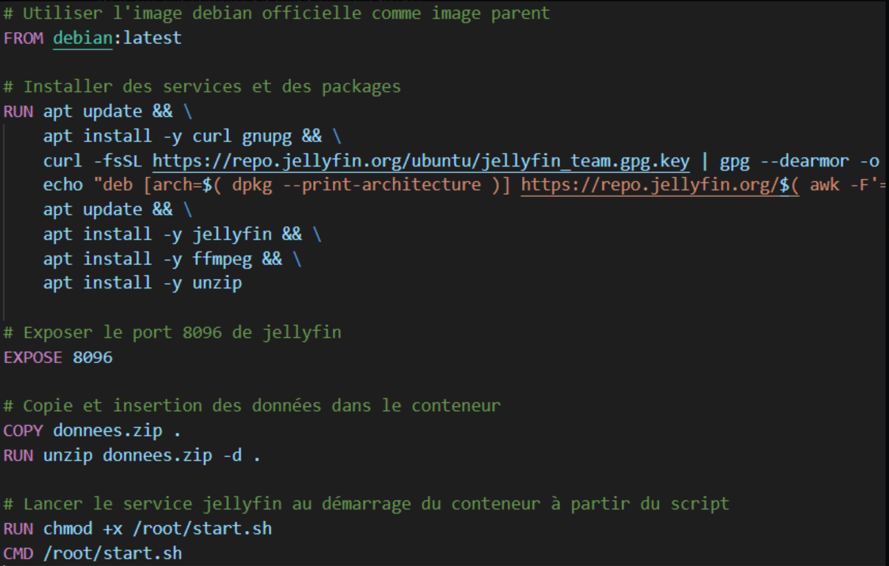

## Qu'est-ce que Docker ?

 Docker est une <b>plateforme de conteneurs</b> lancée en 2013. C'est une solution open source, sécurisée et économique. Conçu à l'origine pour Linux, Docker permet également aux conteneurs de s'exécuter sur Windows ou MAC en raison de la "couche" de virtualisation Linux entre les deux systèmes d'exploitation et l'environnement d'exécution Docker. 
 

 Par conséquent, il est possible d'exécuter des conteneurs Windows natifs dans un environnement de conteneur Linux ou MAC. 

## Qu'est-ce qu'un conteneur ?

 Un conteneur est un environnement d’exécution léger, et une alternative aux méthodes de virtualisation traditionnelles basées sur les machines virtuelles. 

 Pour exécuter les applications, il est nécessaire d’exploiter des packages, des bibliothèques et divers composants logiciels. Pour exploiter ces ressources tout en isolant une application, on utilise initialement les machines virtuelles. 

 Celles-ci permettent de séparer les applications entre elles sur un même système, et de réduire les conflits entre les composants logiciels et la compétition pour les ressources. Cependant, une alternative a vu le jour : les conteneurs. 

 Contrairement à une machine virtuelle de plusieurs Go, un conteneur est plus simple et plus rapide. Il délivre uniquement les ressources nécessaires à une application. En effet, le conteneur partage le kernel de son OS avec d’autres conteneurs. C’est une différence avec une machine virtuelle. 

## Comment fonctionne DockerFile pour Docker ? 

 Chaque conteneur Docker débute avec un <b>Dockerfile</b>. Il s’agit d’un fichier rédigé dans une syntaxe compréhensible, comportant les instructions de création d’une image Docker. Un Dockerfile précise le système d’exploitation sur lequel sera basé le conteneur, ainsi que des langages, variables environnementales et des emplacements de fichiers. 

 Pour créer une image à partir d'un dockerfile, il suffit de taper la ligne de code suivante : 

<code> $ docker build <'NomImage'> </code>  

  Cela va créer une image à partir d'un dockerfile. Si nous n'avons pas l'image localement, elle est téléchargée automatiquement. 

## Les images Docker

 Une image Docker est un modèle en lecture seule, qui est utilisée pour <b>créer des conteneurs Docker</b>. Cette image est composée de plusieurs couches empaquetant toutes les installations/ dépendances /bibliothèques / processus / code d'application qui sont necéssaires pour un environnement de conteneur pleinement opérationnel. Voici la commande necéssaire pour déployer une image vers un conteneur : 

<code> $ docker run 'NomImage' </code>   

## Qu'avons-nous produit dans cette SAE ? 

 L'objectif de cette SAE était <b>d'installer un service réseau</b> à l'aide de Docker et Git Hub. Nous avons opté pour un service de vidéo en ligne via JellyFin car c'était le résultat était le meilleur selon nous, mais aussi car c'était l'un des plus dur à réaliser.  

### Jellyfin, Qu'est-ce que c'est ?

 Jellyfin est une application serveur et multimédia installée sur une machine exécutant Windows, MAC OS, Linux ou dans un conteneur Docker conçues pour organiser, gérer et partager des fichiers multimédias numériques sur des appareils en réseau. Il s'agit d'un fork logiciel gratuit et open source d'Emby. 
	

### La partie DockerFile

 Pour installer notre service de vidéo en ligne, nous avons dû utiliser <b>l'image du Debian officiel comme image parent</b> de notre fichier dockerfile car c'est une contrainte qui nous était imposée. Cela se traduit par cette ligne sur notre fichier : 
 

<code> FROM debian:latest </code>

 Une fois notre image parent mise en place, nous devons implanter des services et des paquets permettant le fonctionnement de notre dockerfile mais aussi de JellyFin : 

 Ces lignes de commandes nous permettent <b>l'installation de l'application Jellyfin mais aussi d'un paquet permettant de lire des fichiers ".mp4"</b>. La dernière ligne permet de créer <b>un dossier data</b>. Celui-ci contiendra les données configurés de Jellyfin, comme par exemple les paramètres ou alors les sources vidéos que nous utiliserons. 

 Afin de pouvoir lancer notre service réseau, nous avons dû passer par un port de la machine, la commande <code> EXPOSE 8096 </code> permet donc d'exposer le port <b>8096</b> de JellyFin. 
 

 Par la suite, nous avons dû copier le script de démarrage nommé "start.sh" dans le conteneur grâce à la commande <code> COPY start.sh /root/ </code>. Cependant, il nous est aussi necéssaire de copier les données configurées de JellyFin dans le conteneur Docker grâce au répertoire "data" crée précédemment. 
 

 Pour finaliser l'écriture de ce DockerFile, nous devions lancer le service Jellyfin au démarrage du conteneur à partir du script de démarrage appelé "start.sh". Cette action se traduit par deux lignes de commande, la première pour le rendre exécutable, et la seconde pour l'exécuter. 

<code> RUN chmod +x /root/start.sh </code> et <code> /root/start.sh </code>

### La partie start.sh

 Ce script démarre jellyfin de manière à ce que l'application se serve des données contenus dans le dossier data que nous avons copié. 

## L'architecture de notre projet

 Dans notre architecture nous avons aussi un dossier "films" qui est un volume relié avec le dossier data/films de notre conteneur permettant l'ajout de film en temps réel sans à avoir à reconstruire notre image. 

 Pour savoir comment lancer notre service de vidéo à la demande, nous vous proposerons un tutoriel dans le fichier README.md de notre projet. 

